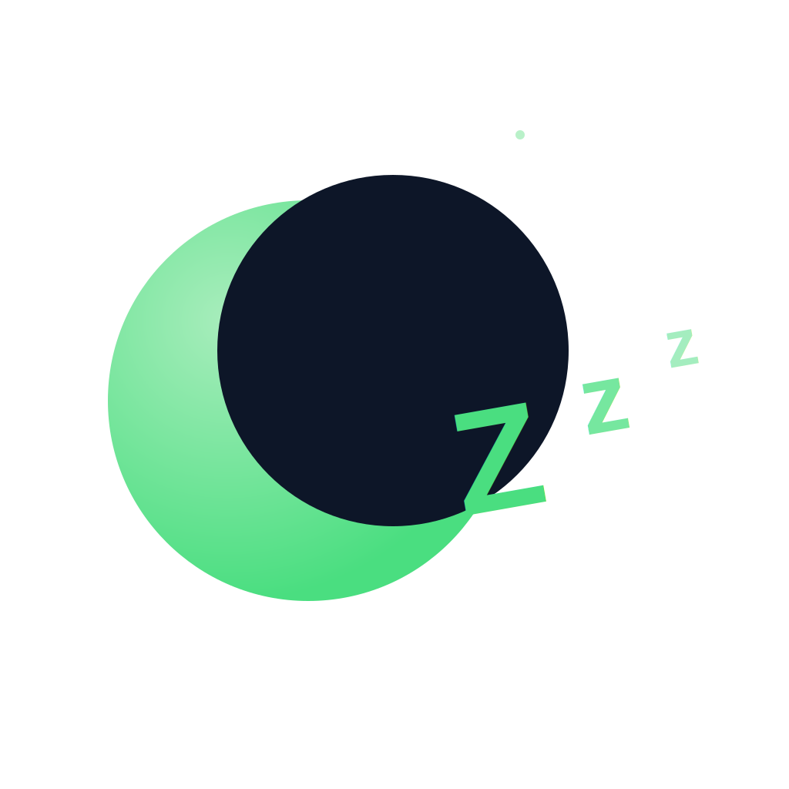
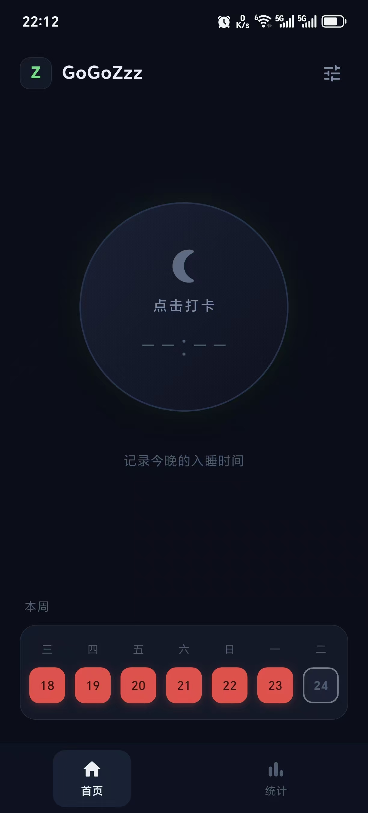
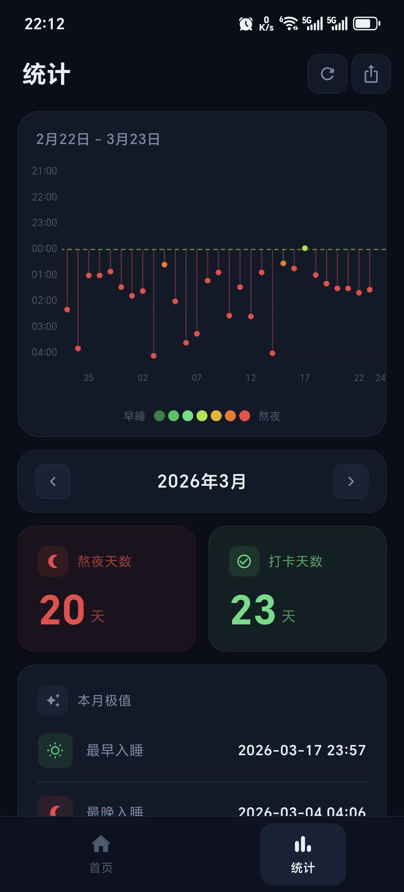
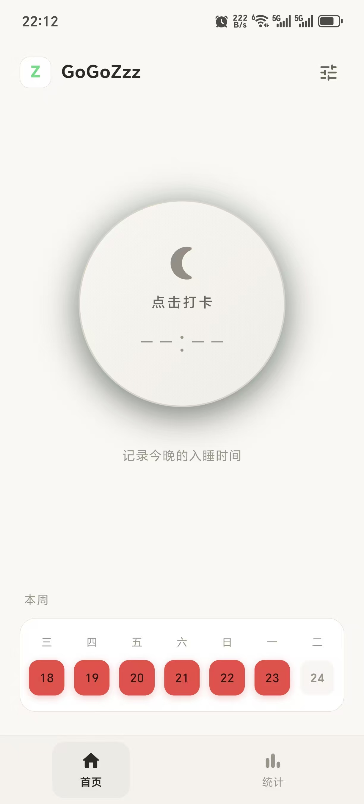
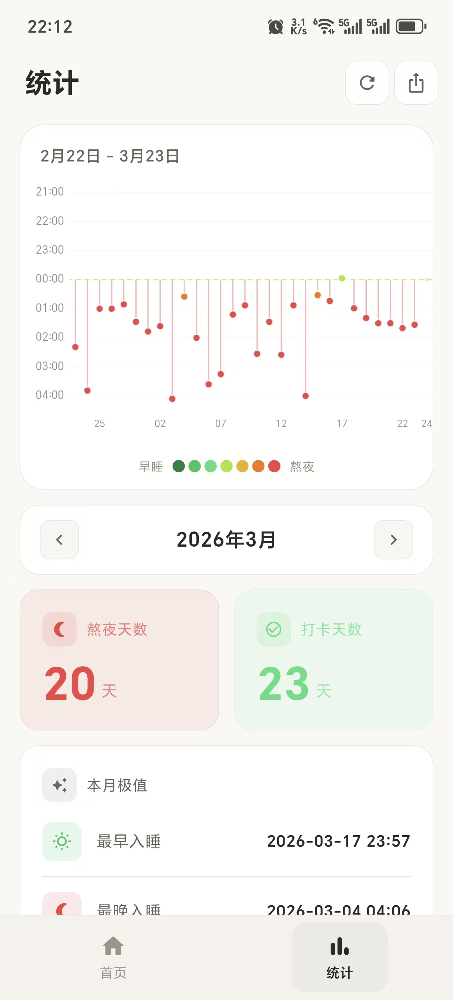
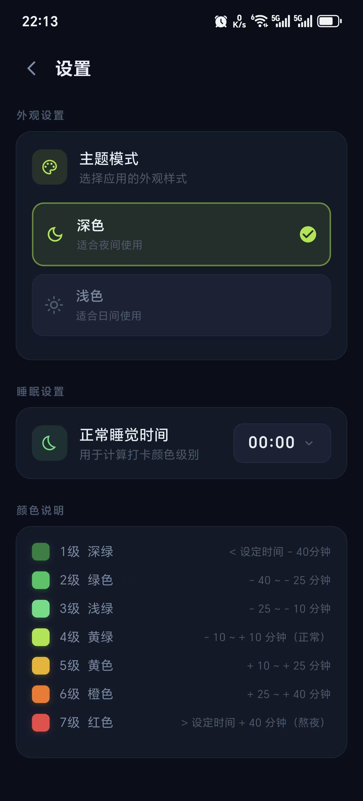

# GoGoZzz

<p align="center">
  
</p>

<p align="center">
  <strong>早睡打卡 · 养成健康睡眠习惯</strong>
</p>

<p align="center">
  一款简洁的睡眠时间记录应用，帮助你培养早睡习惯
</p>

---

## ✨ 功能特性

- **🕐 一键打卡** - 简单记录睡眠时间，支持 18:00 - 次日 06:00 时间段
- **📊 7级颜色评估** - 根据目标睡眠时间，用渐变色直观展示睡眠质量
- **📅 月度热力图** - 日历视图一览整月睡眠记录
- **🔄 补卡功能** - 支持为近 7 天内过去的日期补录记录
- **🌙 深色/浅色主题** - 自动适配系统主题
- **📤 分享功能** - 生成睡眠记录截图分享 *(开发中)*

## 📱 截图

### 深色主题

| 首页 | 统计页 |
|:---:|:---:|
|  |  |

### 浅色主题

| 首页 | 统计页 | 设置页 |
|:---:|:---:|:---:|
|  |  |  |

## 🚀 快速开始

### 环境要求

- Flutter SDK >= 3.0.0
- Dart >= 3.0.0
- Android Studio / VS Code

### 安装运行

```bash
# 克隆仓库
git clone https://github.com/buff-m/GoGoZzz.git
cd GoGoZzz/gogozzz

# 安装依赖
flutter pub get

# 运行应用
flutter run

# 构建 Release APK
flutter build apk --release
```

## 🏗️ 项目结构

```
gogozzz/lib/
├── main.dart              # 应用入口
├── app.dart               # 路由 + 主题配置
├── config/                # 主题颜色配置
├── models/                # 数据模型
├── providers/             # Riverpod 状态管理
├── repositories/          # 数据访问层 (SQLite)
├── services/              # 业务逻辑层
├── screens/               # 页面
├── widgets/               # 复用组件
└── utils/                 # 工具类
```

## 🛠️ 技术栈

- **框架**: [Flutter](https://flutter.dev/)
- **状态管理**: [Riverpod](https://riverpod.dev/)
- **数据库**: [SQLite](sqflite)
- **路由**: [go_router](https://pub.dev/packages/go_router)

## 📄 许可证

本项目基于 [MIT License](LICENSE) 开源。

---

<p align="center">
  Made with ❤️ for better sleep
</p>
