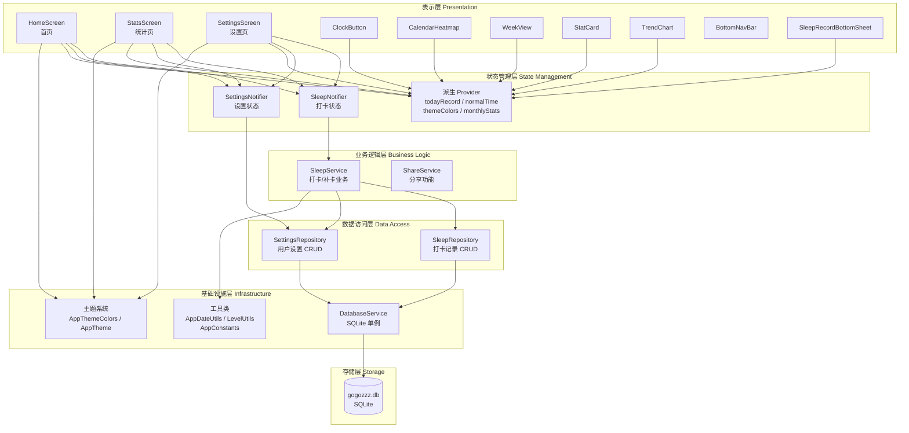
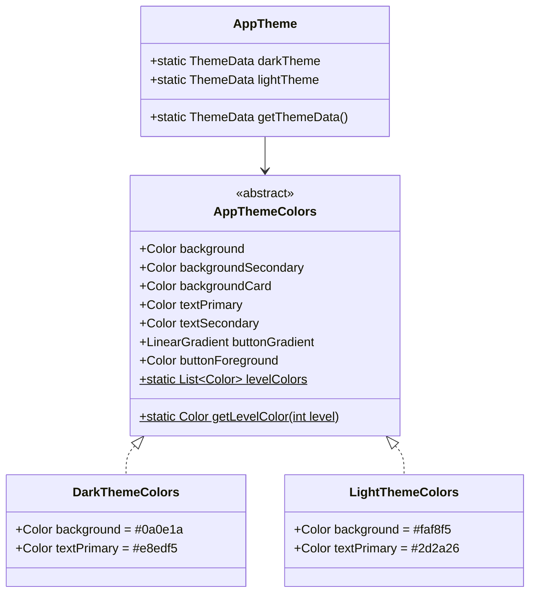
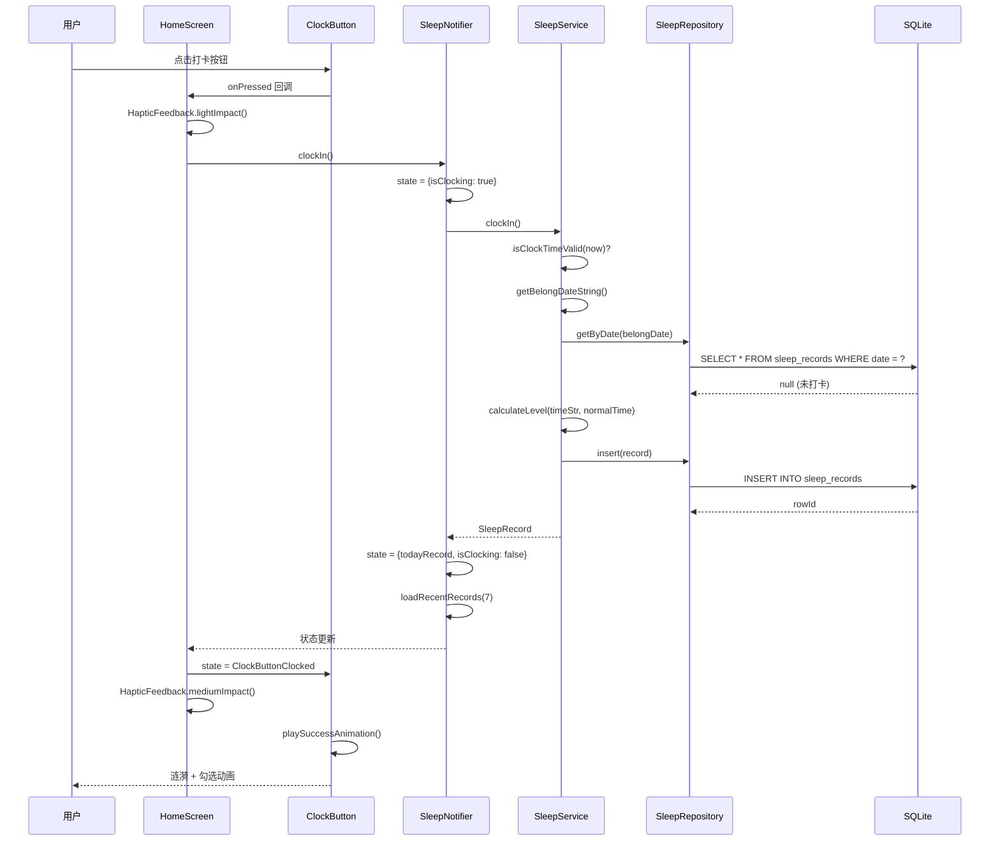
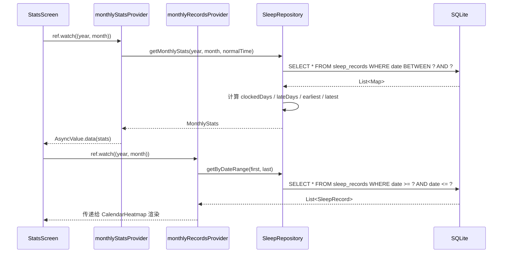
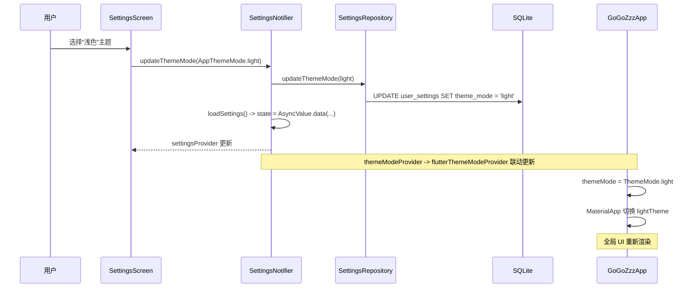
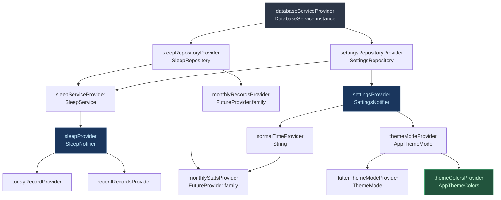
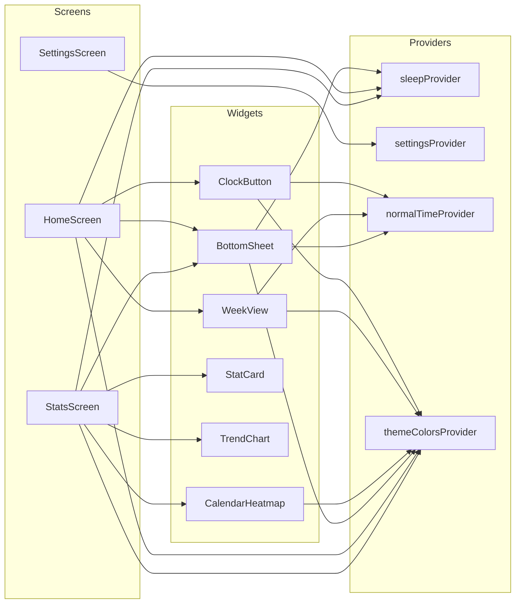
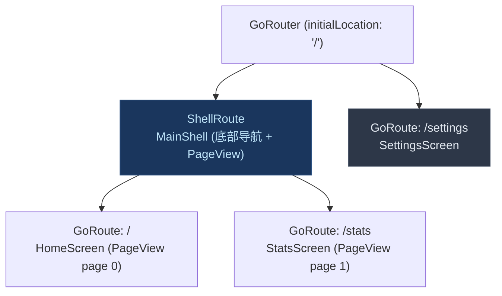
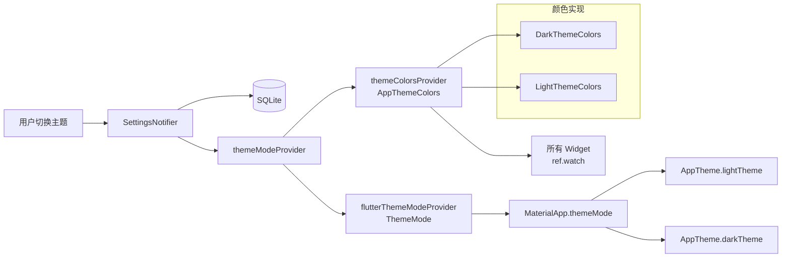
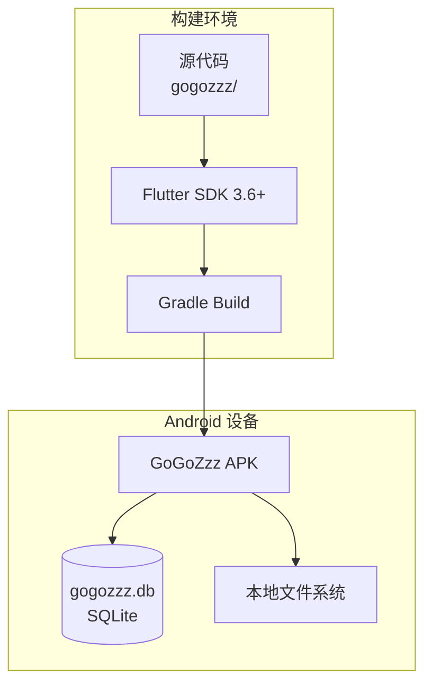

# GoGoZzz 架构设计文档

## 1. 项目概述

### 1.1 项目定位

GoGoZzz 是一款**睡眠时间记录 Flutter 应用**，专注于帮助用户培养早睡习惯。用户通过每日"打卡"记录入睡时间，系统根据偏离目标时间的程度以 7 级颜色直观反馈，辅以月度热力图和趋势统计，形成正向激励闭环。

### 1.2 核心价值

- **极简交互**：一键打卡，无需复杂操作
- **直观反馈**：7 级颜色系统（深绿 -> 红色）让睡眠质量一目了然
- **习惯追踪**：月度热力图 + 趋势对比帮助用户观察长期变化
- **灵活补卡**：支持近 7 天补录，降低漏打卡的挫败感

### 1.3 技术特点

- 纯本地存储，无需网络连接，保护隐私
- 基于 Riverpod 的响应式状态管理，UI 与数据解耦
- 深色/浅色双主题，通过抽象接口实现无感切换
- 归属日期算法处理跨天打卡场景（凌晨 00:00-05:59 归属前一天）

### 1.4 应用场景

| 场景 | 描述 |
|------|------|
| 睡前打卡 | 18:00-06:00 时段内点击打卡按钮记录入睡时间 |
| 查看本周 | 首页周视图展示最近 7 天打卡颜色 |
| 月度回顾 | 统计页日历热力图 + 打卡/熬夜天数 + 极值记录 |
| 补录记录 | 点击未打卡日期，为过去 7 天内的空白日期补卡 |
| 调整目标 | 设置页修改"正常睡觉时间"，颜色级别实时重算 |

---

## 2. 整体架构设计

### 2.1 架构原则

| 原则 | 实践 |
|------|------|
| **单一职责** | 每个文件/类只负责一个明确的功能域 |
| **分层解耦** | UI -> Provider -> Service -> Repository -> DB 严格分层 |
| **依赖注入** | 通过 Riverpod Provider 链注入依赖，便于测试和替换 |
| **不可变数据** | Model 提供 `copyWith` 方法，不直接修改实例 |
| **动态计算** | 颜色级别不持久化为真值，而是基于 normalTime 实时计算 |

### 2.2 架构层次图



### 2.3 设计模式

| 模式 | 应用位置 | 说明 |
|------|---------|------|
| **单例模式** | `DatabaseService` | 全局唯一数据库连接实例 |
| **Repository 模式** | `SleepRepository` / `SettingsRepository` | 封装 SQL 操作，对上层屏蔽存储细节 |
| **StateNotifier 模式** | `SleepNotifier` / `SettingsNotifier` | Riverpod 状态容器，不可变状态更新 |
| **Sealed Class 状态模式** | `ClockButtonState` | 编译期穷举打卡按钮的三种状态 |
| **策略模式（抽象接口）** | `AppThemeColors` | 深色/浅色主题通过不同实现类切换 |
| **依赖注入** | 全部 Provider | 通过 `ref.watch` 自动注入上游依赖 |

### 2.4 架构风格

**分层单体架构（Layered Monolith）**

应用采用经典的四层架构，所有代码在同一个 Flutter 应用内运行。层间通过 Riverpod Provider 链连接，依赖方向严格从上到下：

```
UI层 --> 状态管理层 --> 业务逻辑层 --> 数据访问层 --> 基础设施层
```

---

## 3. 核心模块详解

### 3.1 模块：入口与路由 (app.dart / main.dart)

- **职责**：应用初始化、路由配置、ShellRoute + PageView 实现底部导航和滑动切换
- **关键实现**：
  - `main()` 中 `WidgetsFlutterBinding.ensureInitialized()` + 数据库预初始化
  - `GoRouter` 配置 `ShellRoute` 包裹首页和统计页，`/settings` 独立于 Shell 外
  - `MainShell` 使用 `PageController` + `PageView` 实现左右滑动切换
- **接口**：
  - `GoGoZzzApp.build()` 监听 `flutterThemeModeProvider` 决定 `ThemeMode`
  - `MainShell._onTabTapped(int index)` 驱动 `PageController.animateToPage()`
- **依赖**：`settings_provider.dart`（主题模式）, `go_router`

### 3.2 模块：打卡业务 (SleepService)

- **职责**：打卡核心业务逻辑，包括时间验证、归属日期计算、级别计算、补卡
- **关键接口**：

```dart
Future<SleepRecord> clockIn()                           // 立即打卡
Future<SleepRecord> addMakeupRecord({date, time})       // 补卡
Future<SleepRecord?> getTodayRecord()                   // 获取今日记录
Future<bool> canClockInNow()                            // 当前能否打卡
bool isValidSleepTime(String time)                      // 验证时间范围
```

- **业务规则**：
  - 打卡时间窗口：18:00 - 次日 06:00
  - 补卡限制：仅过去（不含今天），近 7 天内
  - 每个归属日期唯一（UNIQUE 约束）
- **依赖**：`SleepRepository`, `SettingsRepository`, `AppDateUtils`, `LevelUtils`

### 3.3 模块：打卡记录数据访问 (SleepRepository)

- **职责**：封装 `sleep_records` 表的 CRUD 操作 + 月度统计计算
- **关键接口**：

```dart
Future<int> insert(SleepRecord record)
Future<SleepRecord?> getByDate(String date)
Future<List<SleepRecord>> getByDateRange(String start, String end)
Future<List<SleepRecord>> getRecentDays(int days)
Future<MonthlyStats> getMonthlyStats(int year, int month, {String normalTime})
```

- **设计亮点**：`_getSleepTimeOffset()` 将时间映射为 18:00 起始的线性偏移量，解决跨天时间比较问题
- **依赖**：`DatabaseService`

### 3.4 模块：状态管理 (SleepNotifier / SettingsNotifier)

- **职责**：管理 UI 状态，协调 Service 调用，维护派生 Provider
- **SleepNotifier 状态结构**：

```dart
class SleepState {
  final SleepRecord? todayRecord;      // 今日打卡记录
  final List<SleepRecord> recentRecords; // 最近 7 天记录
  final bool isClocking;                // 正在打卡中（loading）
  final String? error;                  // 错误信息
  final DateTime lastUpdated;           // 最后更新时间戳
}
```

- **SettingsNotifier 状态结构**：`AsyncValue<UserSettings>`（loading / data / error 三态）
- **派生 Provider 链**：

```
settingsProvider --> normalTimeProvider       (String)
                 --> themeModeProvider        (AppThemeMode)
                 --> flutterThemeModeProvider (ThemeMode)
                 --> themeColorsProvider      (AppThemeColors)

sleepProvider    --> todayRecordProvider      (SleepRecord?)
                 --> recentRecordsProvider    (List<SleepRecord>)

monthlyStatsProvider   (FutureProvider.family)
monthlyRecordsProvider (FutureProvider.family)
```

### 3.5 模块：主题系统 (config/)

- **职责**：定义深色/浅色主题的完整颜色体系 + 7 级颜色常量
- **架构**：



- **7 级颜色**（全局共享，不随主题变化）：

| 级别 | 颜色值 | 语义 |
|------|--------|------|
| 1 | `#15803d` 深绿 | 非常早 |
| 2 | `#22c55e` 绿色 | 较早 |
| 3 | `#4ade80` 浅绿 | 略早 |
| 4 | `#a3e635` 黄绿 | 正常 |
| 5 | `#eab308` 黄色 | 略晚 |
| 6 | `#f97316` 橙色 | 较晚 |
| 7 | `#ef4444` 红色 | 熬夜 |

### 3.6 模块：工具层 (utils/)

- **AppDateUtils**：日期格式化、归属日期计算、时间偏移计算、月份导航
- **LevelUtils**：级别计算（基于偏移量 + 阈值数组）、打卡时间验证、级别描述
- **AppConstants**：表名、时间范围、阈值数组 `[-40, -25, -10, 10, 25, 40]`、日期格式

### 3.7 模块：UI 组件 (widgets/)

| 组件 | 行数 | 职责 |
|------|------|------|
| `ClockButton` | 374 | 打卡按钮，sealed class 三态 + 按压缩放 + 成功涟漪/勾选动画 |
| `SleepRecordBottomSheet` | 622 | 记录详情抽屉 + 补卡流程（时间选择器 ListWheelScrollView） |
| `CalendarHeatmap` | 255 | 月度日历热力图，动态颜色渲染 + 月份切换 + 图例 |
| `TrendChart` | 174 | 熬夜趋势对比（上月 vs 本月）|
| `StatCard` | 130 | 统计数字卡片（熬夜天数 / 打卡天数）|
| `WeekView` | 126 | 最近 7 天方块视图 |
| `BottomNavBar` | 103 | 自定义底部导航栏 |

---

## 4. 技术栈分析

### 4.1 核心框架

| 技术 | 版本 | 用途 | 选型理由 | 替代方案 |
|------|------|------|---------|---------|
| **Flutter** | SDK ^3.6.1 | 跨平台 UI | Android 优先，未来可扩展 iOS | React Native, Kotlin Multiplatform |
| **flutter_riverpod** | ^2.4.0 | 状态管理 | 编译期安全、Provider 组合、自动刷新 | Bloc, GetX, Provider |
| **go_router** | ^13.0.0 | 路由 | 声明式路由、ShellRoute 支持 | auto_route, Navigator 2.0 |
| **sqflite** | ^2.3.0 | 本地数据库 | 成熟稳定、SQL 灵活 | drift, hive, isar |
| **intl** | ^0.18.1 | 日期格式化 | Flutter 官方推荐 | - |

### 4.2 数据存储

| 技术 | 用途 | 特点 |
|------|------|------|
| SQLite (sqflite) | 打卡记录 + 用户设置 | 支持事务、索引、版本迁移；纯本地，零网络依赖 |

### 4.3 辅助库

| 技术 | 版本 | 用途 |
|------|------|------|
| share_plus | ^7.2.0 | 系统分享 API |
| screenshot | ^2.1.0 | Widget 截图（配合分享）|
| path | ^1.8.3 | 路径拼接（数据库文件路径）|
| flutter_launcher_icons | ^0.13.1 | 应用图标生成（dev 依赖）|

### 4.4 未使用但已配置

| 技术 | 说明 |
|------|------|
| riverpod_annotation + riverpod_generator | 已安装但当前未使用代码生成 |
| build_runner | 配合 riverpod_generator，尚未启用 |

---

## 5. 数据流设计

### 5.1 打卡流程数据流



### 5.2 月度统计数据流



### 5.3 主题切换数据流



### 5.4 核心数据结构

```dart
/// 打卡记录
class SleepRecord {
  final int? id;          // 主键（自增）
  final String date;      // 归属日期 yyyy-MM-dd（UNIQUE）
  final String time;      // 入睡时间 HH:mm
  final int level;        // 缓存级别 1-7（实际使用动态计算）
  final String createdAt; // 创建时间 ISO8601
}

/// 月度统计（聚合模型，非持久化）
class MonthlyStats {
  final int totalDays;     // 当月总天数
  final int clockedDays;   // 打卡天数
  final int lateDays;      // 熬夜天数 (动态计算 level >= 7)
  final String? earliestTime / earliestDate;  // 最早入睡
  final String? latestTime / latestDate;      // 最晚入睡
}

/// 用户设置（单行，id=1）
class UserSettings {
  final String normalTime;    // 正常睡觉时间 HH:mm
  final AppThemeMode themeMode; // dark | light
  final String updatedAt;
}

/// 打卡按钮状态（sealed class）
sealed class ClockButtonState {}
  - ClockButtonCanClock      // 可打卡
  - ClockButtonClocked(time, normalTime)  // 已打卡
  - ClockButtonDisabled      // 时间外禁用
```

---

## 6. 模块接口与依赖

### 6.1 Provider 依赖关系图



### 6.2 模块间调用关系



### 6.3 关键依赖路径

**打卡完整路径**：
```
ClockButton.onPressed
  -> HomeScreen._handleClockIn
    -> SleepNotifier.clockIn
      -> SleepService.clockIn
        -> AppDateUtils.getBelongDateString
        -> SleepRepository.getByDate (查重)
        -> SettingsRepository.getSettings (获取 normalTime)
        -> LevelUtils.calculateLevel
        -> SleepRepository.insert
      -> SleepNotifier.loadRecentRecords
        -> SleepService.getRecentRecords
          -> SleepRepository.getRecentDays
```

---

## 7. 数据库设计

### 7.1 表结构

#### sleep_records

| 字段 | 类型 | 约束 | 说明 |
|------|------|------|------|
| id | INTEGER | PRIMARY KEY AUTOINCREMENT | 主键 |
| date | TEXT | NOT NULL UNIQUE | 归属日期 yyyy-MM-dd |
| time | TEXT | NOT NULL | 入睡时间 HH:mm |
| level | INTEGER | NOT NULL | 缓存级别 1-7 |
| created_at | TEXT | NOT NULL | 创建时间 ISO8601 |

索引：`idx_sleep_records_date ON sleep_records(date)`

#### user_settings

| 字段 | 类型 | 约束 | 说明 |
|------|------|------|------|
| id | INTEGER | PRIMARY KEY | 固定为 1（单行）|
| normal_time | TEXT | NOT NULL DEFAULT '23:00' | 正常睡觉时间 |
| theme_mode | TEXT | NOT NULL DEFAULT 'dark' | 主题模式 |
| updated_at | TEXT | NOT NULL | 更新时间 |

### 7.2 迁移策略

当前数据库版本号为 **2**，使用 sqflite 内置的 `onUpgrade` 回调处理版本迁移：

```
版本 1 -> 2: ALTER TABLE user_settings ADD COLUMN theme_mode TEXT NOT NULL DEFAULT 'dark'
```

迁移代码位于 `DatabaseService._onUpgrade()`，按 `oldVersion` 条件分支逐版本升级。

### 7.3 设计说明

- `date` 字段带 UNIQUE 约束，从数据库层面保证每个归属日期只有一条记录
- `level` 字段为缓存值，实际显示时使用 `SleepRecord.getLevel(normalTime)` 动态计算，因此修改 normalTime 后历史记录颜色会自动更新
- `user_settings` 固定只有 1 行（id=1），首次访问时自动插入默认值

---

## 8. 路由架构

### 8.1 路由结构图



### 8.2 导航方式

| 导航动作 | 触发方式 | 实现 |
|---------|---------|------|
| 首页 <-> 统计页 | 底部导航栏点击 | `PageController.animateToPage()` |
| 首页 <-> 统计页 | 左右滑动 | `PageView.onPageChanged` |
| 进入设置页 | 首页右上角按钮 | `context.push('/settings')` |
| 返回上页 | 设置页左上角返回 | `context.pop()` |

### 8.3 设计说明

- ShellRoute 内的路由实际不渲染 child（返回 `SizedBox.shrink()`），因为页面由 `PageView` 直接管理
- 设置页位于 ShellRoute 外部，进入时不显示底部导航栏
- 无路由守卫需求（纯本地应用，无认证）

---

## 9. 主题系统

### 9.1 架构设计



### 9.2 使用方式

所有 Widget 通过 `ref.watch(themeColorsProvider)` 获取当前主题颜色对象，直接访问属性：

```dart
final colors = ref.watch(themeColorsProvider);
// 使用
colors.background       // 页面背景
colors.backgroundCard   // 卡片背景
colors.textPrimary      // 主文字
colors.buttonGradient   // 按钮渐变
```

### 9.3 双轨制说明

- **AppThemeColors 接口**：运行时通过 Provider 动态切换（推荐方式）
- **AppTheme 静态常量**：保留 `backgroundDark`, `textPrimary` 等 `const` 值，用于向后兼容

---

## 10. 关键设计决策

### 10.1 归属日期逻辑

**问题**：凌晨 0-5 点打卡，用户心理上认为这属于"昨晚"的睡觉时间。

**方案**：`AppDateUtils.getBelongDateString()` 将 00:00-05:59 的打卡记录归属到**前一天**。

```
实际时间          归属日期
2026-03-15 22:30  -> 2026-03-15
2026-03-16 01:30  -> 2026-03-15  (凌晨归属前一天)
2026-03-16 06:00  -> 2026-03-16  (06:00 起归属当天)
```

### 10.2 7 级颜色系统

**问题**：如何直观反映入睡时间与目标的偏差？

**方案**：以 normalTime 为基准，计算分钟偏移量，映射到 7 级阈值：

```
偏移阈值: [-40, -25, -10, +10, +25, +40]

                    normalTime
  1    2    3    |  4  |   5    6    7
深绿  绿色  浅绿  正常  黄色  橙色  红色
<-40  -25  -10  +10  +25  +40  >+40
```

**设计亮点**：level 基于 normalTime 动态计算而非固定存储，用户修改 normalTime 后所有历史记录颜色自动重算。

### 10.3 补卡功能

**问题**：用户忘记打卡导致记录缺失，影响使用体验。

**方案**：
- 限制范围：仅过去的日期（不含今天），近 7 天内
- 时间范围：18:00 - 次日 05:59
- UI 入口：点击日历/周视图中未打卡的日期 -> `SleepRecordBottomSheet` -> 补卡按钮 -> `ListWheelScrollView` 时间选择器

### 10.4 ClockButton 三态 Sealed Class

**问题**：打卡按钮有三种互斥状态，需要在编译期保证穷举。

**方案**：
```dart
sealed class ClockButtonState {}
class ClockButtonCanClock extends ClockButtonState {}
class ClockButtonClocked extends ClockButtonState { String time; String normalTime; }
class ClockButtonDisabled extends ClockButtonState {}
```

优势：Dart 编译器强制在 `switch` 中处理所有分支，防止遗漏状态。

---

## 11. 部署架构

### 11.1 部署拓扑



### 11.2 资源需求

| 资源 | 需求 | 说明 |
|------|------|------|
| 平台 | Android 优先 | iOS 支持需额外配置 |
| 存储 | < 50 MB | APK + 数据库文件 |
| 内存 | 常规 Flutter 应用 | 无大型模型或缓存 |
| 网络 | 不需要 | 纯本地应用 |
| 权限 | 存储权限（分享时） | share_plus 需要 |

### 11.3 构建命令

```bash
cd gogozzz
flutter build apk --release   # Release APK
```

---

## 12. 架构评估

### 12.1 优势分析

| 优势 | 说明 | 体现 |
|------|------|------|
| **清晰分层** | 4 层架构职责明确 | UI/State/Service/Repository 边界清晰 |
| **高内聚低耦合** | 每个文件 < 400 行（多数），职责单一 | 27 个文件平均 170 行 |
| **响应式状态** | Riverpod Provider 自动刷新 | normalTime 变化 -> 所有颜色自动重算 |
| **类型安全** | sealed class、强类型 Provider | ClockButtonState 编译期穷举 |
| **可测试性** | 依赖注入、纯函数工具类 | Repository/Service 可独立单测 |
| **主题扩展性** | 抽象接口 + 实现类 | 新增主题只需添加 `implements AppThemeColors` |
| **零网络依赖** | 纯本地 SQLite | 离线可用，隐私友好 |
| **数据一致性** | UNIQUE 约束 + 归属日期算法 | 数据库级别防重复 |

### 12.2 劣势分析

| 劣势 | 影响 | 改进建议 |
|------|------|---------|
| **无单元测试** | 回归风险高 | 为 Service/Repository/Utils 添加单元测试，目标覆盖率 80% |
| **sleep_record_bottom_sheet.dart 过长** | 622 行，可读性下降 | 拆分为 `_RecordContent`、`_EmptyContent`、`_SleepTimePicker` 独立文件 |
| **settings_screen.dart 过长** | 443 行 | 提取 `ThemeSelector`、`ColorLegend` 为独立 Widget |
| **Repository 层有业务逻辑** | `getMonthlyStats` 包含统计计算 | 将统计聚合逻辑移至 Service 层 |
| **level 字段冗余** | 数据库存储 level 但实际使用动态计算 | 要么去掉 level 字段，要么在 normalTime 变更时批量更新 |
| **无数据备份** | 卸载应用数据丢失 | 添加导出/导入 JSON 功能 |
| **无异常恢复** | 数据库损坏无恢复方案 | 添加定期备份机制 |
| **riverpod_generator 未启用** | 未利用代码生成优势 | 启用 `@riverpod` 注解，减少模板代码 |
| **分享功能未完成** | StatsScreen 中显示 "开发中..." | 实现截图分享流程 |

### 12.3 可扩展性评估

**功能扩展**：
- 新增统计维度（平均入睡时间、最长连续早睡天数） -> 在 `SleepRepository.getMonthlyStats` 或新方法中扩展
- 新增主题 -> 添加 `XxxThemeColors implements AppThemeColors`
- 数据导出 -> 在 Service 层添加 `exportToJson()` 方法
- 通知提醒 -> 添加 `NotificationService`，不影响现有架构

**技术扩展**：
- iOS 发布 -> Flutter 天然跨平台，主要工作在配置层面
- 云同步 -> Repository 层添加远程数据源，Service 层合并本地/远程数据
- 多语言 -> 引入 flutter_localizations，字符串资源化

---

## 13. 安全性考虑

### 13.1 安全现状

| 方面 | 状态 | 说明 |
|------|------|------|
| 数据存储 | 本地明文 | SQLite 无加密 |
| 网络通信 | 无 | 纯离线应用 |
| 用户认证 | 无 | 单用户本地应用 |
| 输入验证 | 有 | Service 层验证时间范围、日期范围 |

### 13.2 建议措施

- 考虑使用 `sqlcipher` 加密数据库（如果涉及敏感健康数据）
- 分享截图时注意不泄露敏感信息

---

## 14. 性能指标

### 14.1 性能特征

| 指标 | 预估 | 说明 |
|------|------|------|
| 启动时间 | < 2s | 数据库预初始化 + 加载设置 + 今日记录 |
| 打卡响应 | < 200ms | 1 次查询 + 1 次插入 |
| 月度统计 | < 100ms | 单月最多 31 条记录，计算量极小 |
| 内存占用 | 常规 | 无大型数据结构缓存 |

### 14.2 潜在瓶颈

- `monthlyRecordsProvider` 和 `monthlyStatsProvider` 在月份切换时分别发起独立查询，可考虑合并
- `CalendarHeatmap` 每次重建都会遍历 records 创建 Map，可考虑在 Provider 层预处理

### 14.3 优化建议

- 启用 `const` 构造函数减少 Widget 重建
- 对 `monthlyRecordsProvider` 添加缓存策略（`keepAlive: true`）
- 打卡动画使用 `RepaintBoundary` 隔离重绘范围

---

## 15. 项目统计

| 指标 | 数值 |
|------|------|
| Dart 源文件数 | 27 |
| 总代码行数 | 4,576 |
| 平均每文件行数 | ~170 |
| 最大文件 | sleep_record_bottom_sheet.dart (622 行) |
| 最小文件 | main.dart (27 行) |
| 第三方依赖 | 7 个运行时 + 4 个开发时 |
| 数据库表 | 2 |
| 数据库版本 | 2 |
| 页面 | 3 (首页、统计、设置) |
| 可复用 Widget | 7 |

---

*文档生成时间：2026-03-16*
*基于 GoGoZzz 项目源代码分析*
